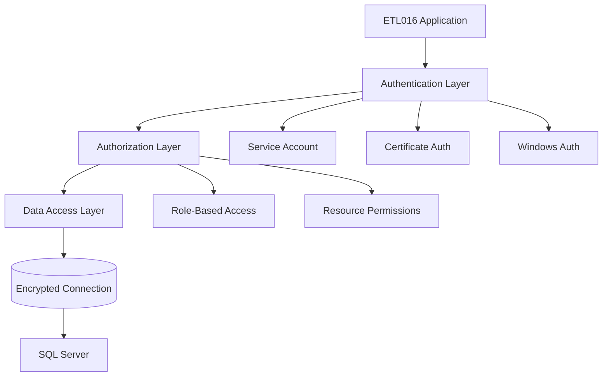
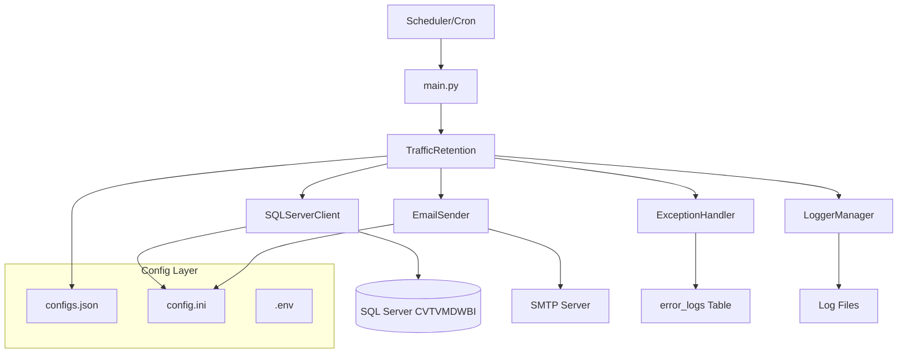

#### **Opcionais para Monitorização**

```txt
psutil==5.9.0                 # System monitoring
memory-profiler==0.61.0       # Memory usage analysis
py-spy==0.3.14                # Performance profiling
```

### **Compatibilidade de SO**

| Sistema Operativo              | Suporte       | Notas                            |
| ------------------------------ | ------------- | -------------------------------- |
| **Windows 10/11**        | ✅ Completo   | ODBC Driver nativo               |
| **Windows Server 2016+** | ✅ Completo   | Ambiente de produção preferido |
| **Ubuntu 18.04+**        | ✅ Completo   | Requer instalação ODBC         |
| **CentOS 7+**            | ✅ Completo   | Requer configuração adicional  |
| **macOS 10.14+**         | ⚠️ Limitado | Desenvolvimento apenas           |

### **Configurações de Performance**

#### **SQL Server Connection Pool**

```python
# Configurações otimizadas para produção
connection_config = {
    "max_pool_size": 100,        # Pool máximo de conexões
    "timeout": 30,               # Timeout de query (segundos)
    "connection_timeout": 15,    # Timeout de conexão
    "retry_count": 3,            # Tentativas de reconexão
    "pool_recycle": 3600         # Reciclar conexões (1h)
}
```

#### **Batch Processing**

```python
# Configurações de lote para grandes volumes
batch_config = {
    "max_delete_batch": 100000,  # Máximo registos por operação
    "batch_size": 10000,         # Tamanho do lote para streaming
    "batch_pause": 1.0,          # Pausa entre lotes (segundos)
    "memory_limit": "2GB"        # Limite de memória por processo
}
```

---

## 🗄️ Estrutura de Base de Dados

### **Tabela Principal: f_trafegoc01**

```sql
-- Estrutura da tabela alvo
CREATE TABLE [dbo].[f_trafegoc01] (
    [ID] bigint IDENTITY(1,1) NOT NULL,
    [Dia] varchar(50) COLLATE SQL_Latin1_General_CP1_CI_AS NULL,
    [Campo1] varchar(100) NULL,
    [Campo2] varchar(100) NULL,
    [Campo3] decimal(18,2) NULL,
    [DataCriacao] datetime2(7) DEFAULT GETDATE(),
    [DataModificacao] datetime2(7) NULL,

    CONSTRAINT [PK_f_trafegoc01] PRIMARY KEY CLUSTERED ([ID])
)
```

#### **Índices Recomendados**

```sql
-- Índice principal para performance de purge
CREATE NONCLUSTERED INDEX [IX_f_trafegoc01_Dia]
ON [dbo].[f_trafegoc01] ([Dia])
WHERE [Dia] IS NOT NULL;

-- Índice para queries temporais (se campo existir)
CREATE NONCLUSTERED INDEX [IX_f_trafegoc01_DataCriacao]
ON [dbo].[f_trafegoc01] ([DataCriacao] DESC);

-- Índice composto para queries de retenção
CREATE NONCLUSTERED INDEX [IX_f_trafegoc01_Dia_Data]
ON [dbo].[f_trafegoc01] ([Dia], [DataCriacao])
INCLUDE ([ID]);
```

### **Tabela de Logs de Erro: error_logs**

```sql
-- Estrutura da tabela de error logs (criada automaticamente)
CREATE TABLE [dbo].[error_logs] (
    [id] bigint IDENTITY(1,1) NOT NULL,
    [error_message] nvarchar(max) NULL,
    [traceback] nvarchar(max) NULL,
    [timestamp] varchar(50) NULL,
    [exception_type] varchar(255) NULL,
    [exception_args] nvarchar(max) NULL,
    [exception_module] varchar(255) NULL,
    [exception_file] varchar(500) NULL,
    [exception_line] int NULL,
    [status] varchar(50) NULL,

    CONSTRAINT [PK_error_logs] PRIMARY KEY CLUSTERED ([id])
)
```

### **Views para Monitorização**

```sql
-- View para análise de retenção
CREATE VIEW [dbo].[vw_traffic_retention_analysis] AS
SELECT
    YEAR(TRY_CONVERT(DATE, [Dia], 103)) as Ano,
    MONTH(TRY_CONVERT(DATE, [Dia], 103)) as Mes,
    COUNT(*) as Total_Registos,
    MIN(TRY_CONVERT(DATE, [Dia], 103)) as Data_Min,
    MAX(TRY_CONVERT(DATE, [Dia], 103)) as Data_Max,
    COUNT(CASE WHEN [Dia] IS NULL THEN 1 END) as Registos_Sem_Data,
    COUNT(CASE WHEN TRY_CONVERT(DATE, [Dia], 103) IS NULL AND [Dia] IS NOT NULL THEN 1 END) as Datas_Invalidas
FROM [dbo].[f_trafegoc01]
GROUP BY YEAR(TRY_CONVERT(DATE, [Dia], 103)), MONTH(TRY_CONVERT(DATE, [Dia], 103));

-- View para monitorização de erros
CREATE VIEW [dbo].[vw_etl016_errors] AS
SELECT
    [timestamp],
    [exception_type],
    [error_message],
    [status],
    ROW_NUMBER() OVER (ORDER BY [timestamp] DESC) as RowNum
FROM [dbo].[error_logs]
WHERE [error_message] LIKE '%ETL016%' OR [error_message] LIKE '%traffic%retention%';
```

### **Stored Procedures de Suporte**

```sql
-- Procedure para análise de performance
CREATE PROCEDURE [dbo].[sp_etl016_performance_analysis]
AS
BEGIN
    SET NOCOUNT ON;

    -- Estatísticas da tabela
    SELECT
        'f_trafegoc01' as Tabela,
        COUNT(*) as Total_Registos,
        COUNT([Dia]) as Registos_Com_Data,
        MIN(TRY_CONVERT(DATE, [Dia], 103)) as Data_Minima,
        MAX(TRY_CONVERT(DATE, [Dia], 103)) as Data_Maxima,
        DATEDIFF(DAY, MIN(TRY_CONVERT(DATE, [Dia], 103)), MAX(TRY_CONVERT(DATE, [Dia], 103))) as Dias_Span
    FROM [dbo].[f_trafegoc01]
    WHERE TRY_CONVERT(DATE, [Dia], 103) IS NOT NULL;

    -- Análise de fragmentação
    SELECT
        i.name AS IndexName,
        ps.avg_fragmentation_in_percent,
        ps.page_count
    FROM sys.dm_db_index_physical_stats(DB_ID(), OBJECT_ID('f_trafegoc01'), NULL, NULL, 'LIMITED') ps
    JOIN sys.indexes i ON ps.object_id = i.object_id AND ps.index_id = i.index_id
    WHERE ps.avg_fragmentation_in_percent > 10;
END
```

---

## 🔌 APIs e Interfaces

### **Classe Principal: TrafficRetention**

```python
class TrafficRetention:
    """
    Classe principal para gestão de retenção de dados.

    Attributes:
        table_name (str): Nome da tabela alvo
        date_column (str): Coluna de data para filtros
        retention_months (int): Meses de retenção
        min_records_safety (int): Mínimo de registos de segurança
        max_delete_batch (int): Máximo de registos por lote
    """

    # Métodos públicos
    def execute_retention_process(self) -> Dict[str, Any]:
        """Executar processo completo de retenção."""

    # Métodos de configuração
    def update_retention_policy(self, months: int, min_records: int):
        """Atualizar política de retenção."""

    def set_batch_size(self, size: int):
        """Configurar tamanho do lote."""

    # Métodos de diagnóstico
    def validate_configuration(self) -> bool:
        """Validar configuração atual."""

    def get_table_statistics(self) -> Dict[str, Any]:
        """Obter estatísticas da tabela."""
```

### **Interface de Configuração**

```python
# Configuration Interface
class ConfigurationManager:
    """Interface unificada para gestão de configurações."""

    @staticmethod
    def load_process_config() -> Dict[str, Any]:
        """Carregar configuração do processo."""

    @staticmethod
    def load_database_config(section: str) -> Dict[str, str]:
        """Carregar configuração de base de dados."""

    @staticmethod
    def validate_all_configs() -> List[str]:
        """Validar todas as configurações."""

    @staticmethod
    def update_config(file: str, section: str, updates: Dict[str, Any]):
        """Atualizar configuração específica."""
```

### **Interface de Monitorização**

```python
# Monitoring Interface
class MonitoringInterface:
    """Interface para monitorização do sistema."""

    def get_system_health(self) -> Dict[str, str]:
        """Verificar saúde do sistema."""

    def get_performance_metrics(self) -> Dict[str, float]:
        """Obter métricas de performance."""

    def get_last_execution_status(self) -> Dict[str, Any]:
        """Status da última execução."""

    def export_metrics(self, format: str = 'json') -> str:
        """Exportar métricas em formato específico."""
```

### **REST API (Futura Expansão)**

```python
# Exemplo de endpoint REST para monitorização
from flask import Flask, jsonify

app = Flask(__name__)

@app.route('/api/v1/etl016/status')
def get_status():
    """Endpoint para verificar status do ETL016."""
    return jsonify({
        "process_id": "ETL016",
        "status": "running",
        "last_execution": "2025-09-10T06:00:00Z",
        "records_processed": 150000,
        "health": "healthy"
    })

@app.route('/api/v1/etl016/metrics')
def get_metrics():
    """Endpoint para métricas detalhadas."""
    return jsonify({
        "table_size": 2500000,
        "retention_cutoff": "2025-06-09",
        "performance": {
            "avg_execution_time": 45.2,
            "success_rate": 0.99
        }
    })
```

---

## ⚡ Performance e Escalabilidade

### **Benchmarks de Performance**

| Operação                  | Volume       | Tempo Esperado | Limite Aceitável |
| --------------------------- | ------------ | -------------- | ----------------- |
| **Contagem Total**    | 1M registos  | < 5s           | < 15s             |
| **Filtro por Data**   | 1M registos  | < 10s          | < 30s             |
| **Delete Batch**      | 10K registos | < 2s           | < 10s             |
| **Processo Completo** | 1M registos  | < 60s          | < 300s            |

### **Otimizações Implementadas**

#### **1. Database Query Optimization**

```sql
-- Query otimizada com índice
DELETE FROM f_trafegoc01
WHERE TRY_CONVERT(DATE, [Dia], 103) < TRY_CONVERT(DATE, ?, 103)
AND [Dia] IS NOT NULL;

-- Alternativa com melhor performance para grandes volumes
WITH RecordsToDelete AS (
    SELECT TOP (100000) [ID]
    FROM f_trafegoc01
    WHERE TRY_CONVERT(DATE, [Dia], 103) < TRY_CONVERT(DATE, ?, 103)
    AND [Dia] IS NOT NULL
)
DELETE f FROM f_trafegoc01 f
INNER JOIN RecordsToDelete r ON f.[ID] = r.[ID];
```

#### **2. Memory Management**

```python
# Configuração de memória otimizada
import gc

class OptimizedTrafficRetention(TrafficRetention):

    def _execute_purge_optimized(self, cutoff_date: datetime) -> int:
        """Purge otimizado para grandes volumes."""

        total_deleted = 0
        batch_size = 5000  # Lotes menores para melhor controlo de memória

        while True:
            # Forçar garbage collection entre lotes
            gc.collect()

            deleted = self._delete_batch(cutoff_date, batch_size)
            total_deleted += deleted

            if deleted < batch_size:
                break

            # Monitorizar uso de memória
            import psutil
            memory_percent = psutil.virtual_memory().percent

            if memory_percent > 80:
                self.logger.warning(f"Uso de memória alto: {memory_percent}%")
                batch_size = max(1000, batch_size // 2)

        return total_deleted
```

#### **3. Connection Pooling**

```python
# Pool de conexões otimizado
class OptimizedSQLServerClient(SQLServerClient):

    def __init__(self, config):
        super().__init__(config)
        self.connection_pool = self._create_optimized_pool()

    def _create_optimized_pool(self):
        """Criar pool otimizado baseado no volume esperado."""

        # Calcular tamanho do pool baseado no volume de dados
        estimated_records = self._estimate_table_size()

        if estimated_records > 5000000:  # > 5M registos
            pool_size = 20
            timeout = 60
        elif estimated_records > 1000000:  # > 1M registos
            pool_size = 10
            timeout = 30
        else:
            pool_size = 5
            timeout = 15

        return {
            "max_pool_size": pool_size,
            "timeout": timeout,
            "pool_recycle": 1800  # 30 minutos
        }
```

### **Escalabilidade Horizontal**

#### **Estratégia de Particionamento**

```sql
-- Particionamento por mês para melhor performance
CREATE PARTITION FUNCTION pf_traffic_monthly (varchar(50))
AS RANGE RIGHT FOR VALUES
('1/1/2024', '1/2/2024', '1/3/2024', '1/4/2024',
 '1/5/2024', '1/6/2024', '1/7/2024', '1/8/2024',
 '1/9/2024', '1/10/2024', '1/11/2024', '1/12/2024');

CREATE PARTITION SCHEME ps_traffic_monthly
AS PARTITION pf_traffic_monthly
ALL TO ([PRIMARY]);

-- Recriar tabela com particionamento
CREATE TABLE [dbo].[f_trafegoc01_partitioned] (
    [ID] bigint IDENTITY(1,1) NOT NULL,
    [Dia] varchar(50) COLLATE SQL_Latin1_General_CP1_CI_AS NULL,
    -- outros campos...

    CONSTRAINT [PK_f_trafegoc01_part] PRIMARY KEY CLUSTERED ([ID], [Dia])
) ON ps_traffic_monthly([Dia]);
```

#### **Processamento Paralelo**

```python
# Implementação de processamento paralelo
import concurrent.futures
from typing import List

class ParallelTrafficRetention(TrafficRetention):

    def _execute_parallel_purge(self, cutoff_date: datetime, num_workers: int = 4) -> int:
        """Executar purge em paralelo."""

        # Dividir trabalho por ranges de ID
        id_ranges = self._get_id_ranges(num_workers)

        total_deleted = 0

        with concurrent.futures.ThreadPoolExecutor(max_workers=num_workers) as executor:
            # Submeter tasks para cada range
            futures = []
            for start_id, end_id in id_ranges:
                future = executor.submit(
                    self._delete_range,
                    cutoff_date, start_id, end_id
                )
                futures.append(future)

            # Recolher resultados
            for future in concurrent.futures.as_completed(futures):
                try:
                    deleted = future.result()
                    total_deleted += deleted
                except Exception as e:
                    self.logger.error(f"Erro em worker paralelo: {e}")

        return total_deleted

    def _get_id_ranges(self, num_workers: int) -> List[Tuple[int, int]]:
        """Dividir IDs em ranges para processamento paralelo."""

        # Obter min e max ID
        query = "SELECT MIN([ID]) as min_id, MAX([ID]) as max_id FROM f_trafegoc01"
        result = self.db_client.execute_query(query, fetch_as_dict=True)[0]

        min_id, max_id = result['min_id'], result['max_id']
        range_size = (max_id - min_id) // num_workers

        ranges = []
        for i in range(num_workers):
            start = min_id + (i * range_size)
            end = min_id + ((i + 1) * range_size) if i < num_workers - 1 else max_id
            ranges.append((start, end))

        return ranges
```

---

## 🔐 Segurança

### **Modelo de Segurança**



### **Configurações de Segurança**

#### **1. Encriptação de Conexões**

```python
# String de conexão com encriptação
connection_string = (
    "DRIVER={ODBC Driver 17 for SQL Server};"
    "SERVER=192.168.81.150,1433;"
    "DATABASE=DMETL;"
    "UID=talend_user;"
    "PWD=***;"
    "Encrypt=yes;"                    # Forçar encriptação
    "TrustServerCertificate=no;"      # Validar certificado
    "Connection Timeout=30;"
)
```

#### **2. Gestão Segura de Credenciais**

```python
# Integração com Azure Key Vault
from azure.keyvault.secrets import SecretClient
from azure.identity import DefaultAzureCredential

class SecureConfigManager:

    def __init__(self, vault_url: str):
        credential = DefaultAzureCredential()
        self.client = SecretClient(vault_url=vault_url, credential=credential)

    def get_database_password(self) -> str:
        """Obter password da base de dados do Key Vault."""
        secret = self.client.get_secret("etl016-db-password")
        return secret.value

    def get_smtp_credentials(self) -> Tuple[str, str]:
        """Obter credenciais SMTP do Key Vault."""
        username = self.client.get_secret("etl016-smtp-username").value
        password = self.client.get_secret("etl016-smtp-password").value
        return username, password
```

#### **3. Auditoria e Logging**

```python
# Sistema de auditoria
class AuditLogger:

    def __init__(self, db_client):
        self.db_client = db_client

    def log_access(self, user: str, action: str, resource: str, success: bool):
        """Registar acesso para auditoria."""

        audit_query = """
        INSERT INTO [dbo].[audit_log] (
            [timestamp], [user_id], [action], [resource],
            [success], [ip_address], [session_id]
        ) VALUES (?, ?, ?, ?, ?, ?, ?)
        """

        import socket
        import uuid

        values = (
            datetime.now(),
            user,
            action,
            resource,
            success,
            socket.gethostbyname(socket.gethostname()),
            str(uuid.uuid4())
        )

        self.db_client.execute_query(audit_query, values)

    def log_data_modification(self, table: str, operation: str, record_count: int):
        """Registar modificações de dados."""

        mod_query = """
        INSERT INTO [dbo].[data_modification_log] (
            [timestamp], [table_name], [operation],
            [record_count], [process_id], [user_context]
        ) VALUES (?, ?, ?, ?, ?, ?)
        """

        values = (
            datetime.now(),
            table,
            operation,
            record_count,
            "ETL016",
            os.getenv('USERNAME', 'system')
        )

        self.db_client.execute_query(mod_query, values)
```

### **Permissões Mínimas Requeridas**

```sql
-- Criar role específica para ETL016
CREATE ROLE [etl016_role];

-- Permissões na tabela principal
GRANT SELECT, DELETE ON [dbo].[f_trafegoc01] TO [etl016_role];

-- Permissões na tabela de logs
GRANT SELECT, INSERT, UPDATE ON [dbo].[error_logs] TO [etl016_role];

-- Permissões nas views de monitorização
GRANT SELECT ON [dbo].[vw_traffic_retention_analysis] TO [etl016_role];
GRANT SELECT ON [dbo].[vw_etl016_errors] TO [etl016_role];

-- Permissões para stored procedures
GRANT EXECUTE ON [dbo].[sp_etl016_performance_analysis] TO [etl016_role];

-- Atribuir role ao utilizador
ALTER ROLE [etl016_role] ADD MEMBER [talend_user];
```

---

## 📊 Monitorização

### **Métricas Chave (KPIs)**

| Métrica                  | Tipo        | Frequência        | Threshold              |
| ------------------------- | ----------- | ------------------ | ---------------------- |
| **Execution Time**  | Performance | Cada execução    | < 300s                 |
| **Records Deleted** | Business    | Diário            | > 0                    |
| **Success Rate**    | Reliability | Semanal            | > 95%                  |
| **Memory Usage**    | Resource    | Durante execução | < 80%                  |
| **CPU Usage**       | Resource    | Durante execução | < 70%                  |
| **Database Size**   | Capacity    | Diário            | Monitorizar tendência |

### **Dashboard de Monitorização**

```python
# Gerador de métricas para dashboard
class MetricsCollector:

    def collect_execution_metrics(self) -> Dict[str, Any]:
        """Recolher métricas de execução."""

        return {
            "timestamp": datetime.now().isoformat(),
            "process_id": "ETL016",
            "metrics": {
                "execution_time": self._get_last_execution_time(),
                "records_processed": self._get_records_processed(),
                "memory_peak": self._get_memory_peak(),
                "cpu_avg": self._get_cpu_average(),
                "success_status": self._get_last_success_status()
            },
            "health_indicators": {
                "database_connectivity": self._test_db_connection(),
                "email_service": self._test_email_service(),
                "log_file_accessibility": self._test_log_access()
            }
        }

    def export_to_prometheus(self) -> str:
        """Exportar métricas no formato Prometheus."""

        metrics = self.collect_execution_metrics()

        prometheus_format = f"""
# HELP etl016_execution_time_seconds Time taken for ETL016 execution
# TYPE etl016_execution_time_seconds gauge
etl016_execution_time_seconds {metrics['metrics']['execution_time']}

# HELP etl016_records_processed_total Total records processed by ETL016
# TYPE etl016_records_processed_total counter
etl016_records_processed_total {metrics['metrics']['records_processed']}

# HELP etl016_success_status ETL016 last execution success status
# TYPE etl016_success_status gauge
etl016_success_status {1 if metrics['metrics']['success_status'] else 0}
"""

        return prometheus_format
```

### **Alertas Automatizados**

```python
# Sistema de alertas baseado em thresholds
class AlertManager:

    def __init__(self, email_sender: EmailSender):
        self.email_sender = email_sender
        self.alert_thresholds = {
            "execution_time": 300,      # 5 minutos
            "memory_usage": 80,         # 80%
            "success_rate": 0.95,       # 95%
            "consecutive_failures": 3    # 3 falhas seguidas
        }

    def check_and_send_alerts(self, metrics: Dict[str, Any]):
        """Verificar métricas e enviar alertas se necessário."""

        alerts = []

        # Verificar tempo de execução
        if metrics['execution_time'] > self.alert_thresholds['execution_time']:
            alerts.append({
                "type": "performance",
                "severity": "warning",
                "message": f"Execution time {metrics['execution_time']}s exceeds threshold"
            })

        # Verificar uso de memória
        if metrics['memory_peak'] > self.alert_thresholds['memory_usage']:
            alerts.append({
                "type": "resource",
                "severity": "warning",
                "message": f"Memory usage {metrics['memory_peak']}% exceeds threshold"
            })

        # Verificar falhas consecutivas
        consecutive_failures = self._get_consecutive_failures()
        if consecutive_failures >= self.alert_thresholds['consecutive_failures']:
            alerts.append({
                "type": "reliability",
                "severity": "critical",
                "message": f"{consecutive_failures} consecutive failures detected"
            })

        # Enviar alertas
        for alert in alerts:
            self._send_alert(alert)

    def _send_alert(self, alert: Dict[str, Any]):
        """Enviar alerta específico."""

        severity_colors = {
            "info": "info",
            "warning": "warning",
            "critical": "danger"
        }

        self.email_sender.send_template_email(
            report_config={
                "to": "alertas.rpa@cvt.cv",
                "subject": f"ETL016 Alert - {alert['severity'].upper()}"
            },
            alert_type=severity_colors[alert['severity']],
            alert_title=f"ETL016 {alert['type'].title()} Alert",
            alert_message=alert['message'],
            timestamp=datetime.now().isoformat()
        )
```

### **Integração com Sistemas de Monitorização**

#### **Grafana Dashboard Configuration**

```json
{
  "dashboard": {
    "title": "ETL016 - Traffic Data Retention",
    "panels": [
      {
        "title": "Execution Time",
        "type": "graph",
        "targets": [
          {
            "expr": "etl016_execution_time_seconds",
            "legend": "Execution Time (s)"
          }
        ]
      },
      {
        "title": "Records Processed",
        "type": "singlestat",
        "targets": [
          {
            "expr": "increase(etl016_records_processed_total[1d])",
            "legend": "Daily Records"
          }
        ]
      },
      {
        "title": "Success Rate",
        "type": "gauge",
        "targets": [
          {
            "expr": "avg_over_time(etl016_success_status[7d])",
            "legend": "7-day Success Rate"
          }
        ]
      }
    ]
  }
}
```

#### **Nagios/Icinga Check**

```bash
#!/bin/bash
# check_etl016.sh - Nagios check script

LAST_LOG=$(find /path/to/logs -name "agt003dsi_*.log" -type f -printf '%T@ %p\n' | sort -n | tail -1 | cut -d' ' -f2-)
LAST_SUCCESS=$(grep "PROCESSO CONCLUÍDO COM SUCESSO" "$LAST_LOG" | tail -1)
LAST_ERROR=$(grep "ERROR" "$LAST_LOG" | tail -1)

if [[ -n "$LAST_SUCCESS" ]]; then
    SUCCESS_TIME=$(echo "$LAST_SUCCESS" | cut -d' ' -f1-2)
    SUCCESS_TIMESTAMP=$(date -d "$SUCCESS_TIME" +%s)
    CURRENT_TIMESTAMP=$(date +%s)

    # Verificar se execução foi nas últimas 26 horas
    if [[ $((CURRENT_TIMESTAMP - SUCCESS_TIMESTAMP)) -lt 93600 ]]; then
        echo "OK - ETL016 executed successfully at $SUCCESS_TIME"
        exit 0
    else
        echo "WARNING - ETL016 last success was over 26 hours ago"
        exit 1
    fi
elif [[ -n "$LAST_ERROR" ]]; then
    echo "CRITICAL - ETL016 has errors in log"
    exit 2
else
    echo "UNKNOWN - Cannot determine ETL016 status"
    exit 3
fi
```

---

## 📚 Documentação de APIs

### **Python API Documentation**

```python
"""
ETL016 Traffic Data Retention System

This module provides automated data retention capabilities for the f_trafegoc01 table,
maintaining only the last 3 months of traffic data while ensuring data integrity
and providing comprehensive monitoring and alerting.

Classes:
    TrafficRetention: Main class for data retention operations
    ConfigurationManager: Configuration management utilities
    MonitoringInterface: System monitoring and health checks

Examples:
    Basic usage:
        >>> with TrafficRetention() as retention:
        ...     metrics = retention.execute_retention_process()
        ...     print(f"Deleted {metrics['records_deleted']} records")

    Custom configuration:
        >>> retention = TrafficRetention()
        >>> retention.retention_months = 2  # Keep only 2 months
        >>> retention.min_records_safety = 500  # Lower safety threshold
        >>> metrics = retention.execute_retention_process()

    Monitoring integration:
        >>> monitor = MonitoringInterface()
        >>> health = monitor.get_system_health()
        >>> metrics = monitor.get_performance_metrics()
"""

class TrafficRetention:
    """
    Main class for traffic data retention operations.

    This class handles the automated deletion of old traffic records from the
    f_trafegoc01 table while maintaining data integrity and providing detailed
    logging and reporting capabilities.

    Attributes:
        table_name (str): Target table name (default: 'f_trafegoc01')
        date_column (str): Date column name (default: '[Dia]')
        retention_months (int): Number of months to retain (default: 3)
        min_records_safety (int): Minimum records safety threshold (default: 1000)
        max_delete_batch (int): Maximum records per batch operation (default: 100000)

    Example:
        >>> retention = TrafficRetention()
        >>> metrics = retention.execute_retention_process()
        >>> print(f"Process completed: {metrics['success']}")
        >>> print(f"Records deleted: {metrics['records_deleted']}")
    """

    def __init__(self):
        """
        Initialize the TrafficRetention instance.

        Sets up database connections, email services, and logging components.
        Loads configuration from configs.json and config.ini files.

        Raises:
            FileNotFoundError: If configuration files are missing
            ConnectionError: If database connection fails
            ConfigurationError: If configuration is invalid
        """

    def execute_retention_process(self) -> Dict[str, Any]:
        """
        Execute the complete data retention process.

        This method performs the following steps:
        1. Validates table existence and connectivity
        2. Calculates retention cutoff date (current date - retention_months)
        3. Analyzes data distribution and validates safety constraints
        4. Executes deletion in transactional batches
        5. Sends success/error reports via email
        6. Returns detailed execution metrics

        Returns:
            Dict[str, Any]: Execution metrics containing:
                - success (bool): Whether process completed successfully
                - records_deleted (int): Number of records removed
                - records_kept (int): Number of records remaining
                - execution_time (float): Process duration in seconds
                - cutoff_date (str): Date threshold used for deletion
                - start_time (str): Process start timestamp
                - end_time (str): Process completion timestamp

        Raises:
            DatabaseError: If database operations fail
            ValidationError: If safety constraints are violated
            EmailError: If notification sending fails (non-fatal)

        Example:
            >>> retention = TrafficRetention()
            >>> result = retention.execute_retention_process()
            >>> if result['success']:
            ...     print(f"✅ Deleted {result['records_deleted']:,} old records")
            ... else:
            ...     print(f"❌ Process failed: {result.get('error', 'Unknown error')}")
        """

    def update_retention_policy(self, months: int, min_records: int = None):
        """
        Update the data retention policy.

        Args:
            months (int): Number of months to retain (must be > 0)
            min_records (int, optional): Minimum records safety threshold

        Raises:
            ValueError: If months <= 0 or min_records < 0

        Example:
            >>> retention.update_retention_policy(6, min_records=2000)
            >>> # Now retains 6 months of data with 2000 record minimum
        """

    def validate_configuration(self) -> bool:
        """
        Validate current configuration settings.

        Checks database connectivity, table existence, email settings,
        and configuration file integrity.

        Returns:
            bool: True if all validations pass, False otherwise

        Example:
            >>> if not retention.validate_configuration():
            ...     print("Configuration issues detected!")
        """

    def get_table_statistics(self) -> Dict[str, Any]:
        """
        Get comprehensive statistics about the target table.

        Returns:
            Dict[str, Any]: Table statistics including:
                - total_records (int): Total number of records
                - records_with_dates (int): Records with valid dates
                - invalid_dates (int): Records with invalid date formats
                - oldest_date (str): Earliest date in dataset
                - newest_date (str): Latest date in dataset
                - estimated_size_mb (float): Estimated table size in MB

        Example:
            >>> stats = retention.get_table_statistics()
            >>> print(f"Table has {stats['total_records']:,} records")
            >>> print(f"Date range: {stats['oldest_date']} to {stats['newest_date']}")
        """

class ConfigurationManager:
    """
    Utility class for managing system configurations.

    Provides centralized access to configuration files and validation
    of configuration parameters across the system.
    """

    @staticmethod
    def load_process_config(config_file: str = 'configs.json') -> Dict[str, Any]:
        """
        Load process configuration from JSON file.

        Args:
            config_file (str): Path to configuration file

        Returns:
            Dict[str, Any]: Parsed configuration dictionary

        Raises:
            FileNotFoundError: If config file doesn't exist
            JSONDecodeError: If config file has invalid JSON
        """

    @staticmethod
    def validate_all_configs() -> List[str]:
        """
        Validate all system configurations.

        Returns:
            List[str]: List of validation errors (empty if all valid)
        """

class MonitoringInterface:
    """
    Interface for system monitoring and health checks.

    Provides methods to check system health, gather performance metrics,
    and export data for external monitoring systems.
    """

    def get_system_health(self) -> Dict[str, str]:
        """
        Perform comprehensive system health check.

        Returns:
            Dict[str, str]: Health status for each component:
                - database: 'healthy' | 'degraded' | 'unhealthy'
                - email_service: 'healthy' | 'degraded' | 'unhealthy'
                - file_system: 'healthy' | 'degraded' | 'unhealthy'
                - overall: 'healthy' | 'degraded' | 'unhealthy'
        """

    def get_performance_metrics(self) -> Dict[str, float]:
        """
        Get current performance metrics.

        Returns:
            Dict[str, float]: Performance metrics:
                - avg_execution_time: Average execution time in seconds
                - success_rate: Success rate over last 30 days (0.0-1.0)
                - cpu_usage: Current CPU usage percentage
                - memory_usage: Current memory usage percentage
                - disk_usage: Current disk usage percentage
        """

    def export_metrics(self, format: str = 'json') -> str:
        """
        Export metrics in specified format.

        Args:
            format (str): Export format ('json', 'prometheus', 'csv')

        Returns:
            str: Formatted metrics data

        Raises:
            ValueError: If format is not supported
        """
```

### **REST API Specification (OpenAPI 3.0)**

```yaml
# api_spec.yaml
openapi: 3.0.0
info:
  title: ETL016 Traffic Data Retention API
  version: 1.0.0
  description: API for monitoring and controlling the ETL016 data retention process
  contact:
    name: DSI-RPA CVT
    email: dsi-suporte-rpa@cvt.cv

servers:
  - url: https://api.cvt.cv/etl016/v1
    description: Production server
  - url: https://api-dev.cvt.cv/etl016/v1
    description: Development server

paths:
  /status:
    get:
      summary: Get ETL016 process status
      description: Returns current status and basic information about the ETL016 process
      responses:
        '200':
          description: Process status retrieved successfully
          content:
            application/json:
              schema:
                type: object
                properties:
                  process_id:
                    type: string
                    example: "ETL016"
                  status:
                    type: string
                    enum: [running, completed, failed, scheduled]
                  last_execution:
                    type: string
                    format: date-time
                  next_execution:
                    type: string
                    format: date-time
                  health:
                    type: string
                    enum: [healthy, degraded, unhealthy]

  /metrics:
    get:
      summary: Get detailed metrics
      parameters:
        - name: period
          in: query
          schema:
            type: string
            enum: [1h, 24h, 7d, 30d]
            default: 24h
      responses:
        '200':
          description: Metrics retrieved successfully
          content:
            application/json:
              schema:
                type: object
                properties:
                  table_statistics:
                    $ref: '#/components/schemas/TableStatistics'
                  performance_metrics:
                    $ref: '#/components/schemas/PerformanceMetrics'
                  execution_history:
                    type: array
                    items:
                      $ref: '#/components/schemas/ExecutionRecord'

  /execute:
    post:
      summary: Trigger manual execution
      description: Manually trigger the retention process (admin only)
      security:
        - ApiKeyAuth: []
      requestBody:
        content:
          application/json:
            schema:
              type: object
              properties:
                dry_run:
                  type: boolean
                  default: false
                retention_months:
                  type: integer
                  minimum: 1
                  maximum: 12
      responses:
        '202':
          description: Execution started
          content:
            application/json:
              schema:
                type: object
                properties:
                  execution_id:
                    type: string
                  status:
                    type: string
                    example: "started"

components:
  schemas:
    TableStatistics:
      type: object
      properties:
        total_records:
          type: integer
          example: 2500000
        records_with_dates:
          type: integer
        invalid_dates:
          type: integer
        oldest_date:
          type: string
          format: date
        newest_date:
          type: string
          format: date
        estimated_size_mb:
          type: number

    PerformanceMetrics:
      type: object
      properties:
        avg_execution_time:
          type: number
          example: 45.2
        success_rate:
          type: number
          minimum: 0
          maximum: 1
          example: 0.99
        cpu_usage:
          type: number
        memory_usage:
          type: number

    ExecutionRecord:
      type: object
      properties:
        timestamp:
          type: string
          format: date-time
        success:
          type: boolean
        records_deleted:
          type: integer
        execution_time:
          type: number
        error_message:
          type: string
          nullable: true

  securitySchemes:
    ApiKeyAuth:
      type: apiKey
      in: header
      name: X-API-Key
```

---

## 🔄 Versionamento e Deployment

### **Estratégia de Versionamento**

| Componente               | Estratégia         | Formato       | Exemplo       |
| ------------------------ | ------------------- | ------------- | ------------- |
| **Aplicação**    | Semantic Versioning | X.Y.Z         | 1.2.3         |
| **Base de Dados**  | Migration Scripts   | YYYYMMDD_HHmm | 20250910_0600 |
| **Configuração** | Git Tags            | vX.Y.Z        | v1.2.3        |
| **Documentação** | Branch-based        | main/develop  | -             |

### **Pipeline de Deployment**

```yaml
# .github/workflows/deploy.yml
name: ETL016 Deployment Pipeline

on:
  push:
    tags:
      - 'v*'

jobs:
  test:
    runs-on: ubuntu-latest
    steps:
      - uses: actions/checkout@v3
      - name: Set up Python
        uses: actions/setup-python@v4
        with:
          python-version: '3.10'
      - name: Install dependencies
        run: |
          pip install -r requirements.txt
          pip install pytest pytest-cov
      - name: Run tests
        run: |
          pytest tests/ --cov=./ --cov-report=xml
      - name: Upload coverage
        uses: codecov/codecov-action@v3

  security-scan:
    runs-on: ubuntu-latest
    steps:
      - uses: actions/checkout@v3
      - name: Run security scan
        run: |
          pip install bandit safety
          bandit -r . -f json -o bandit-report.json
          safety check --json --output safety-report.json

  deploy-staging:
    needs: [test, security-scan]
    runs-on: ubuntu-latest
    environment: staging
    steps:
      - name: Deploy to staging
        run: |
          # Deployment steps for staging environment
          scp -r ./ staging-server:/opt/etl016/
          ssh staging-server "cd /opt/etl016 && ./deploy.sh"

  deploy-production:
    needs: [deploy-staging]
    runs-on: ubuntu-latest
    environment: production
    if: startsWith(github.ref, 'refs/tags/v')
    steps:
      - name: Deploy to production
        run: |
          # Deployment steps for production environment
          scp -r ./ prod-server:/opt/etl016/
          ssh prod-server "cd /opt/etl016 && ./deploy.sh"
```

### **Migration Scripts**

```sql
-- migrations/20250910_0600_add_audit_tables.sql
-- ETL016 Migration: Add audit and monitoring tables

IF NOT EXISTS (SELECT * FROM sysobjects WHERE name='audit_log' AND xtype='U')
BEGIN
    CREATE TABLE [dbo].[audit_log] (
        [id] bigint IDENTITY(1,1) NOT NULL,
        [timestamp] datetime2(7) NOT NULL DEFAULT GETDATE(),
        [user_id] varchar(100) NOT NULL,
        [action] varchar(50) NOT NULL,
        [resource] varchar(200) NOT NULL,
        [success] bit NOT NULL,
        [ip_address] varchar(45) NULL,
        [session_id] varchar(100) NULL,
        [details] nvarchar(max) NULL,

        CONSTRAINT [PK_audit_log] PRIMARY KEY CLUSTERED ([id])
    )

    CREATE INDEX [IX_audit_log_timestamp] ON [dbo].[audit_log] ([timestamp] DESC)
    CREATE INDEX [IX_audit_log_user_action] ON [dbo].[audit_log] ([user_id], [action])

    PRINT 'Table audit_log created successfully'
END

IF NOT EXISTS (SELECT * FROM sysobjects WHERE name='data_modification_log' AND xtype='U')
BEGIN
    CREATE TABLE [dbo].[data_modification_log] (
        [id] bigint IDENTITY(1,1) NOT NULL,
        [timestamp] datetime2(7) NOT NULL DEFAULT GETDATE(),
        [table_name] varchar(100) NOT NULL,
        [operation] varchar(20) NOT NULL,
        [record_count] int NOT NULL,
        [process_id] varchar(50) NOT NULL,
        [user_context] varchar(100) NULL,
        [execution_id] varchar(100) NULL,

        CONSTRAINT [PK_data_modification_log] PRIMARY KEY CLUSTERED ([id])
    )

    CREATE INDEX [IX_data_mod_log_timestamp] ON [dbo].[data_modification_log] ([timestamp] DESC)
    CREATE INDEX [IX_data_mod_log_process] ON [dbo].[data_modification_log] ([process_id], [timestamp] DESC)

    PRINT 'Table data_modification_log created successfully'
END

-- Update version tracking
IF NOT EXISTS (SELECT * FROM sysobjects WHERE name='schema_version' AND xtype='U')
BEGIN
    CREATE TABLE [dbo].[schema_version] (
        [version] varchar(20) NOT NULL,
        [applied_date] datetime2(7) NOT NULL DEFAULT GETDATE(),
        [description] varchar(500) NULL,

        CONSTRAINT [PK_schema_version] PRIMARY KEY CLUSTERED ([version])
    )
END

INSERT INTO [dbo].[schema_version] ([version], [description])
VALUES ('20250910_0600', 'Add audit and monitoring tables for ETL016')

PRINT 'Migration 20250910_0600 completed successfully'
```

---

## 📊 Testing e Quality Assurance

### **Estrutura de Testes**

```
tests/
├── unit/
│   ├── test_traffic_retention.py
│   ├── test_configuration.py
│   ├── test_email_sender.py
│   └── test_utils.py
├── integration/
│   ├── test_database_operations.py
│   ├── test_email_integration.py
│   └── test_end_to_end.py
├── performance/
│   ├── test_large_dataset.py
│   └── test_concurrent_access.py
└── fixtures/
    ├── sample_data.sql
    └── test_configs.json
```

### **Testes Unitários**

```python
# tests/unit/test_traffic_retention.py
import pytest
from unittest.mock import Mock, patch
from datetime import datetime, timedelta
from traffic_retention import TrafficRetention

class TestTrafficRetention:

    @pytest.fixture
    def mock_retention(self):
        """Fixture for mocked TrafficRetention instance."""
        with patch('traffic_retention.load_json_config'), \
             patch('traffic_retention.load_ini_config'), \
             patch('traffic_retention.DatabaseFactory'):
            retention = TrafficRetention()
            retention.db_client = Mock()
            retention.crud = Mock()
            retention.email_sender = Mock()
            return retention

    def test_calculate_cutoff_date(self, mock_retention):
        """Test cutoff date calculation logic."""

        # Test normal case
        with patch('traffic_retention.datetime') as mock_datetime:
            mock_datetime.now.return_value = datetime(2025, 9, 10)
            mock_datetime.side_effect = lambda *args, **kw: datetime(*args, **kw)

            cutoff = mock_retention._calculate_cutoff_date()

            expected = datetime(2025, 6, 10)
            assert cutoff == expected

    def test_parse_date_string_valid_formats(self, mock_retention):
        """Test date string parsing with various valid formats."""

        test_cases = [
            ("9/6/2025", datetime(2025, 6, 9)),
            ("09/06/2025", datetime(2025, 6, 9)),
            ("31/12/2024", datetime(2024, 12, 31)),
            ("1/1/2025", datetime(2025, 1, 1))
        ]

        for date_str, expected in test_cases:
            result = mock_retention._parse_date_string(date_str)
            assert result == expected, f"Failed for {date_str}"

    def test_parse_date_string_invalid_formats(self, mock_retention):
        """Test date string parsing with invalid formats."""

        invalid_dates = [
            "32/13/2025",  # Invalid day/month
            "not-a-date",  # Non-date string
            "",            # Empty string
            None,          # None value
            "2025-06-09"   # Wrong format
        ]

        for invalid_date in invalid_dates:
            result = mock_retention._parse_date_string(invalid_date)
            assert result is None, f"Should be None for {invalid_date}"

    def test_validate_safety_constraints(self, mock_retention):
        """Test safety constraint validation."""

        # Test normal case - should pass
        assert mock_retention._validate_safety_constraints(5000, 1000) == True

        # Test too few records remaining - should fail
        assert mock_retention._validate_safety_constraints(500, 1000) == False

        # Test too many records to delete - should fail
        mock_retention.max_delete_batch = 50000
        assert mock_retention._validate_safety_constraints(5000, 60000) == False

        # Test no records to delete - should fail
        assert mock_retention._validate_safety_constraints(5000, 0) == False

    @patch('traffic_retention.datetime')
    def test_execute_retention_process_success(self, mock_datetime, mock_retention):
        """Test successful execution of retention process."""

        # Setup mocks
        mock_datetime.now.return_value = datetime(2025, 9, 10)
        mock_retention._validate_table_exists.return_value = True
        mock_retention._get_record_counts.return_value = (10000, 8000, 2000)
        mock_retention._validate_safety_constraints.return_value = True
        mock_retention._execute_purge.return_value = 2000

        # Execute
        result = mock_retention.execute_retention_process()

        # Verify
        assert result['success'] == True
        assert result['records_deleted'] == 2000
        assert result['records_kept'] == 8000
        assert 'execution_time' in result
```

### **Testes de Integração**

```python
# tests/integration/test_database_operations.py
import pytest
import pyodbc
from database_connection import DatabaseFactory

class TestDatabaseIntegration:

    @pytest.fixture(scope="class")
    def db_client(self):
        """Database client fixture for integration tests."""
        config = {
            'server': 'test-server',
            'port': '1433',
            'database': 'test_db',
            'login': 'test_user',
            'password': 'test_pass'
        }

        client = DatabaseFactory.get_database('sqlserver', config)
        client.connect()
        yield client
        client.disconnect()

    def test_table_exists_check(self, db_client):
        """Test table existence check."""

        # Create test table
        db_client.execute_query("""
            IF NOT EXISTS (SELECT * FROM sysobjects WHERE name='test_retention' AND xtype='U')
            CREATE TABLE test_retention (
                id int IDENTITY(1,1),
                dia varchar(50),
                data datetime
            )
        """)

        # Test existence check
        from sqlserver_generic_crud import SQLServerGenericCRUD
        crud = SQLServerGenericCRUD(db_client)

        assert crud.table_exists('test_retention') == True
        assert crud.table_exists('nonexistent_table') == False

    def test_record_count_operations(self, db_client):
        """Test record counting operations."""

        # Insert test data
        test_data = [
            ('9/6/2025',),
            ('10/6/2025',),
            ('9/9/2025',),
            ('10/9/2025',)
        ]

        from sqlserver_generic_crud import SQLServerGenericCRUD
        crud = SQLServerGenericCRUD(db_client)

        crud.create('test_retention', test_data, ['dia'])

        # Test counting
        total_result = db_client.execute_query(
            "SELECT COUNT(*) as total FROM test_retention",
            fetch_as_dict=True
        )

        assert total_result[0]['total'] == 4

    def test_date_filtering(self, db_client):
        """Test date-based filtering operations."""

        # Test TRY_CONVERT functionality
        filter_query = """
        SELECT COUNT(*) as filtered
        FROM test_retention
        WHERE TRY_CONVERT(DATE, dia, 103) < TRY_CONVERT(DATE, '9/9/2025', 103)
        """

        result = db_client.execute_query(filter_query, fetch_as_dict=True)

        # Should find records before 9/9/2025
        assert result[0]['filtered'] >= 0
```

### **Testes de Performance**

```python
# tests/performance/test_large_dataset.py
import pytest
import time
from unittest.mock import patch
from traffic_retention import TrafficRetention

class TestPerformance:

    @pytest.mark.performance
    def test_large_dataset_processing(self):
        """Test performance with large dataset simulation."""

        with patch('traffic_retention.TrafficRetention') as MockRetention:
            # Simulate large dataset
            mock_instance = MockRetention.return_value
            mock_instance._get_record_counts.return_value = (1000000, 800000, 200000)
            mock_instance._validate_safety_constraints.return_value = True

            # Mock batch processing
            def mock_execute_purge(cutoff_date):
                time.sleep(0.1)  # Simulate processing time
                return 200000

            mock_instance._execute_purge = mock_execute_purge

            start_time = time.time()
            result = mock_instance.execute_retention_process()
            execution_time = time.time() - start_time

            # Performance assertions
            assert execution_time < 5.0  # Should complete within 5 seconds
            assert result['records_deleted'] == 200000

    @pytest.mark.performance
    def test_memory_usage(self):
        """Test memory usage during processing."""

        import psutil
        import os

        process = psutil.Process(os.getpid())
        initial_memory = process.memory_info().rss

        # Simulate processing
        with patch('traffic_retention.TrafficRetention') as MockRetention:
            mock_instance = MockRetention.return_value
            mock_instance.execute_retention_process()

        final_memory = process.memory_info().rss
        memory_increase = final_memory - initial_memory

        # Memory should not increase by more than 100MB
        assert memory_increase < 100 * 1024 * 1024
```

### **Quality Gates**

```yaml
# .github/workflows/quality-gates.yml
name: Quality Gates

on: [push, pull_request]

jobs:
  code-quality:
    runs-on: ubuntu-latest
    steps:
      - uses: actions/checkout@v3

      - name: Set up Python
        uses: actions/setup-python@v4
        with:
          python-version: '3.10'

      - name: Install dependencies
        run: |
          pip install flake8 black isort mypy bandit
          pip install -r requirements.txt

      - name: Code formatting check
        run: |
          black --check .
          isort --check-only .

      - name: Linting
        run: |
          flake8 . --count --select=E9,F63,F7,F82 --show-source --statistics
          flake8 . --count --exit-zero --max-complexity=10 --max-line-length=127 --statistics

      - name: Type checking
        run: |
          mypy . --ignore-missing-imports

      - name: Security scan
        run: |
          bandit -r . -f json -o bandit-report.json

      - name: Upload artifacts
        uses: actions/upload-artifact@v3
        with:
          name: quality-reports
          path: |
            bandit-report.json

  test-coverage:
    runs-on: ubuntu-latest
    steps:
      - uses: actions/checkout@v3

      - name: Run tests with coverage
        run: |
          pytest --cov=./ --cov-report=xml --cov-fail-under=80

      - name: Upload coverage to Codecov
        uses: codecov/codecov-action@v3
        with:
          file: ./coverage.xml
          flags: unittests
          name: codecov-umbrella
```

---

## 🔒 Compliance e Auditoria

### **Requisitos de Compliance**

| Regulamento            | Aplicabilidade          | Controlos Implementados           |
| ---------------------- | ----------------------- | --------------------------------- |
| **RGPD**         | Dados pessoais          | Pseudonimização, Logs de acesso |
| **SOX**          | Controlos financeiros   | Auditoria de alterações         |
| **ISO 27001**    | Segurança informação | Gestão de acessos                |
| **CVT Internal** | Políticas internas     | Retenção de dados               |

### **Logs de Auditoria**

```sql
-- Estrutura de auditoria completa
CREATE TABLE [dbo].[etl016_audit_trail] (
    [audit_id] bigint IDENTITY(1,1) NOT NULL,
    [timestamp] datetime2(7) NOT NULL DEFAULT GETDATE(),
    [process_id] varchar(50) NOT NULL DEFAULT 'ETL016',
    [operation_type] varchar(50) NOT NULL, -- START, DELETE, COMPLETE, ERROR
    [table_name] varchar(100) NOT NULL,
    [records_affected] int NULL,
    [execution_id] varchar(100) NOT NULL,
    [user_context] varchar(100) NOT NULL,
    [server_name] varchar(100) NOT NULL DEFAULT @@SERVERNAME,
    [database_name] varchar(100) NOT NULL DEFAULT DB_NAME(),
    [cutoff_date] varchar(50) NULL,
    [safety_constraints] nvarchar(500) NULL,
    [performance_metrics] nvarchar(max) NULL, -- JSON format
    [error_details] nvarchar(max) NULL,
    [compliance_flags] varchar(200) NULL,

    CONSTRAINT [PK_etl016_audit_trail] PRIMARY KEY CLUSTERED ([audit_id])
);

-- Índices para performance de consultas de auditoria
CREATE INDEX [IX_etl016_audit_timestamp] ON [dbo].[etl016_audit_trail] ([timestamp] DESC);
CREATE INDEX [IX_etl016_audit_execution] ON [dbo].[etl016_audit_trail] ([execution_id]);
CREATE INDEX [IX_etl016_audit_operation] ON [dbo].[etl016_audit_trail] ([operation_type], [timestamp] DESC);
```

---

 **📞 Suporte Técnico** : Para questões técnicas detalhadas, contactar dsi-suporte-rpa@cvt.cv

 **📚 Documentação Complementar** :

* [Guia de Configuração]()
* [Manual de Troubleshooting]()
* [Changelog]()# 🔧 Especificações Técnicas - ETL016

Documentação técnica detalhada do sistema de retenção de dados de tráfego.

## 📋 Índice

1. [Visão Geral da Arquitetura](#vis%C3%A3o-geral-da-arquitetura)
2. [Especificações de Sistema](#especifica%C3%A7%C3%B5es-de-sistema)
3. [Estrutura de Base de Dados](#estrutura-de-base-de-dados)
4. [APIs e Interfaces](#apis-e-interfaces)
5. [Performance e Escalabilidade](#performance-e-escalabilidade)
6. [Segurança](#seguran%C3%A7a)
7. [Monitorização](#monitoriza%C3%A7%C3%A3o)

---

## 🏗️ Visão Geral da Arquitetura

### **Arquitetura High-Level**



### **Padrões de Design Implementados**

| Padrão                     | Implementação                         | Benefício                   |
| --------------------------- | --------------------------------------- | ---------------------------- |
| **Factory Pattern**   | `DatabaseFactory`                     | Abstração de tipos de BD   |
| **Strategy Pattern**  | Múltiplos CRUD por BD                  | Flexibilidade de backends    |
| **Template Method**   | `EmailSender.generate_alert()`        | Templates reutilizáveis     |
| **Context Manager**   | `TrafficRetention.__enter__/__exit__` | Cleanup automático          |
| **Decorator Pattern** | `@timed`,`@retry`                   | Funcionalidades transversais |

### **Camadas da Aplicação**

```
┌─────────────────────────────────────┐
│           Presentation Layer        │  # main.py, CLI
├─────────────────────────────────────┤
│           Business Logic            │  # TrafficRetention
├─────────────────────────────────────┤
│           Service Layer             │  # EmailSender, ExceptionHandler
├─────────────────────────────────────┤
│           Data Access Layer         │  # CRUD Classes
├─────────────────────────────────────┤
│           Infrastructure            │  # Database Clients
└─────────────────────────────────────┘
```

---

## 💻 Especificações de Sistema

### **Requisitos Mínimos**

| Componente           | Especificação Mínima | Recomendado     |
| -------------------- | ----------------------- | --------------- |
| **CPU**        | 2 cores 2.0GHz          | 4 cores 2.5GHz+ |
| **RAM**        | 4GB                     | 8GB+            |
| **Storage**    | 50GB disponível        | 100GB+ SSD      |
| **Python**     | 3.8+                    | 3.10+           |
| **SQL Server** | 2016+                   | 2019+           |

### **Dependências Técnicas**

#### **Principais (requirements.txt)**

```txt
pyodbc==5.2.0                 # SQL Server connectivity
Jinja2==3.1.6                 # Email templates
python-dotenv==1.0.1          # Environment variables
python-dateutil==2.9.0.post0  # Date parsing utilities
```

#### **Opcionais para Monitorização**

```txt
psutil==5.9.0                 # System monitoring
memory
```
